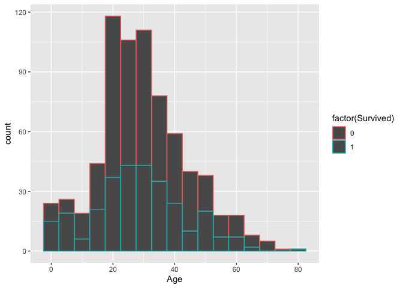
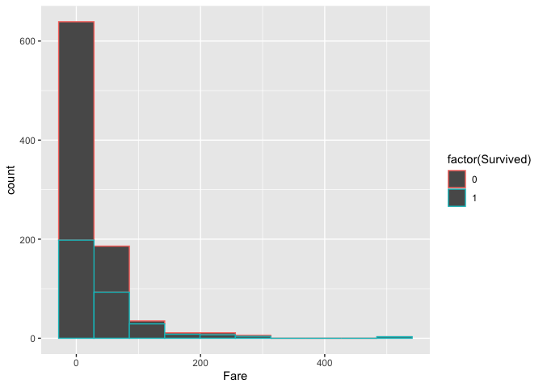
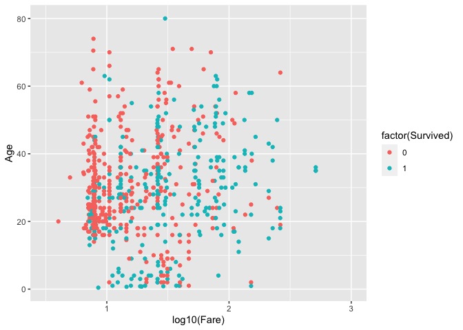
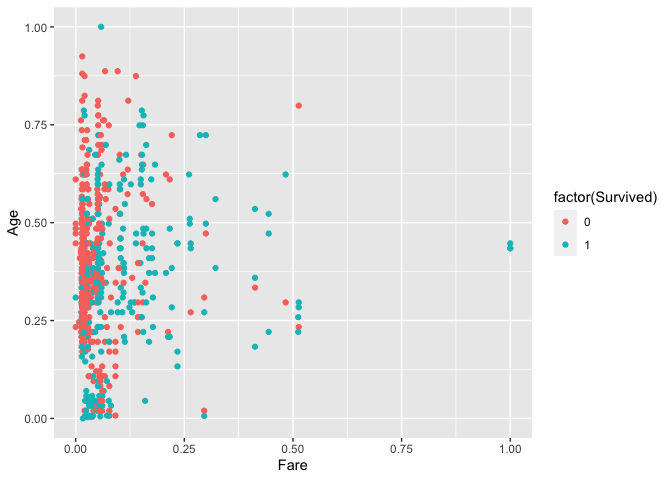
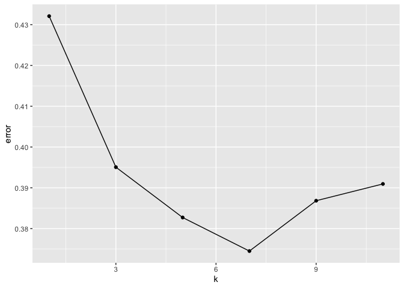
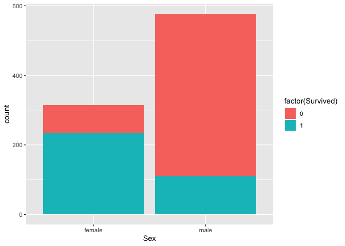
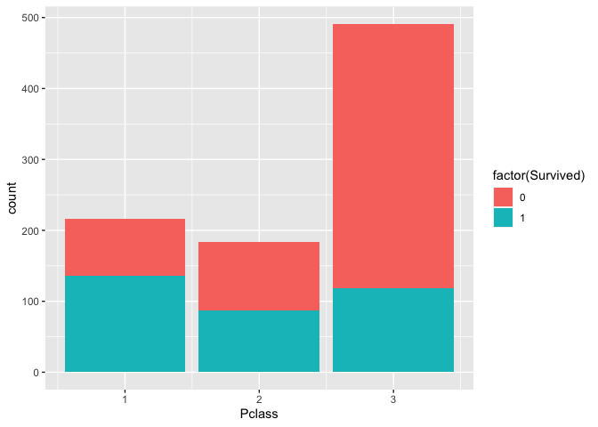

Titanic\_kNN
================
Elsita Kiekebusch
7/9/2020

``` r
#packages needed
library(knitr)
knitr::opts_chunk$set(echo = TRUE)
library(readr)
library(dplyr)
library(ggplot2)
library(class)
library(psych)
```

Titanic Dataset
---------------

The goal is to predict survival on the Titanic using the k-Nearest Neighbors classification algorithm. The data and challenge are available here: <https://www.kaggle.com/c/titanic>

This demonstration code was created as part of a presentation on the kNN algorithm for the ML presentation group at the Recurse Center. Slides here: <https://docs.google.com/presentation/d/1ShwB97-faps3C5_OIx3ZHHfO2_er1Vj6U63rKghz1xE/edit?usp=sharing>

I analyze the data through training and validation for purpose of example. I do not make a prediction on the testing dataset here. 

Brief Exploration of Training and Testing datasets
--------------------------------------------------

``` r
#filepath omitted

#the data from: https://www.kaggle.com/c/titanic/overview
train <- read_csv("train.csv")
```

    ## Parsed with column specification:
    ## cols(
    ##   PassengerId = col_double(),
    ##   Survived = col_double(),
    ##   Pclass = col_double(),
    ##   Name = col_character(),
    ##   Sex = col_character(),
    ##   Age = col_double(),
    ##   SibSp = col_double(),
    ##   Parch = col_double(),
    ##   Ticket = col_character(),
    ##   Fare = col_double(),
    ##   Cabin = col_character(),
    ##   Embarked = col_character()
    ## )

``` r
test <- read_csv("test.csv")
```

    ## Parsed with column specification:
    ## cols(
    ##   PassengerId = col_double(),
    ##   Pclass = col_double(),
    ##   Name = col_character(),
    ##   Sex = col_character(),
    ##   Age = col_double(),
    ##   SibSp = col_double(),
    ##   Parch = col_double(),
    ##   Ticket = col_character(),
    ##   Fare = col_double(),
    ##   Cabin = col_character(),
    ##   Embarked = col_character()
    ## )

``` r
str(train)
```

    ## Classes 'spec_tbl_df', 'tbl_df', 'tbl' and 'data.frame': 891 obs. of  12 variables:
    ##  $ PassengerId: num  1 2 3 4 5 6 7 8 9 10 ...
    ##  $ Survived   : num  0 1 1 1 0 0 0 0 1 1 ...
    ##  $ Pclass     : num  3 1 3 1 3 3 1 3 3 2 ...
    ##  $ Name       : chr  "Braund, Mr. Owen Harris" "Cumings, Mrs. John Bradley (Florence Briggs Thayer)" "Heikkinen, Miss. Laina" "Futrelle, Mrs. Jacques Heath (Lily May Peel)" ...
    ##  $ Sex        : chr  "male" "female" "female" "female" ...
    ##  $ Age        : num  22 38 26 35 35 NA 54 2 27 14 ...
    ##  $ SibSp      : num  1 1 0 1 0 0 0 3 0 1 ...
    ##  $ Parch      : num  0 0 0 0 0 0 0 1 2 0 ...
    ##  $ Ticket     : chr  "A/5 21171" "PC 17599" "STON/O2. 3101282" "113803" ...
    ##  $ Fare       : num  7.25 71.28 7.92 53.1 8.05 ...
    ##  $ Cabin      : chr  NA "C85" NA "C123" ...
    ##  $ Embarked   : chr  "S" "C" "S" "S" ...
    ##  - attr(*, "spec")=
    ##   .. cols(
    ##   ..   PassengerId = col_double(),
    ##   ..   Survived = col_double(),
    ##   ..   Pclass = col_double(),
    ##   ..   Name = col_character(),
    ##   ..   Sex = col_character(),
    ##   ..   Age = col_double(),
    ##   ..   SibSp = col_double(),
    ##   ..   Parch = col_double(),
    ##   ..   Ticket = col_character(),
    ##   ..   Fare = col_double(),
    ##   ..   Cabin = col_character(),
    ##   ..   Embarked = col_character()
    ##   .. )

``` r
#labeled - Survived
#10 features - categorical and numeric
summary(train) #there are missing values
```

    ##   PassengerId       Survived          Pclass          Name          
    ##  Min.   :  1.0   Min.   :0.0000   Min.   :1.000   Length:891        
    ##  1st Qu.:223.5   1st Qu.:0.0000   1st Qu.:2.000   Class :character  
    ##  Median :446.0   Median :0.0000   Median :3.000   Mode  :character  
    ##  Mean   :446.0   Mean   :0.3838   Mean   :2.309                     
    ##  3rd Qu.:668.5   3rd Qu.:1.0000   3rd Qu.:3.000                     
    ##  Max.   :891.0   Max.   :1.0000   Max.   :3.000                     
    ##                                                                     
    ##      Sex                 Age            SibSp           Parch       
    ##  Length:891         Min.   : 0.42   Min.   :0.000   Min.   :0.0000  
    ##  Class :character   1st Qu.:20.12   1st Qu.:0.000   1st Qu.:0.0000  
    ##  Mode  :character   Median :28.00   Median :0.000   Median :0.0000  
    ##                     Mean   :29.70   Mean   :0.523   Mean   :0.3816  
    ##                     3rd Qu.:38.00   3rd Qu.:1.000   3rd Qu.:0.0000  
    ##                     Max.   :80.00   Max.   :8.000   Max.   :6.0000  
    ##                     NA's   :177                                     
    ##     Ticket               Fare           Cabin             Embarked        
    ##  Length:891         Min.   :  0.00   Length:891         Length:891        
    ##  Class :character   1st Qu.:  7.91   Class :character   Class :character  
    ##  Mode  :character   Median : 14.45   Mode  :character   Mode  :character  
    ##                     Mean   : 32.20                                        
    ##                     3rd Qu.: 31.00                                        
    ##                     Max.   :512.33                                        
    ## 

``` r
str(test) #unlabeled
```

    ## Classes 'spec_tbl_df', 'tbl_df', 'tbl' and 'data.frame': 418 obs. of  11 variables:
    ##  $ PassengerId: num  892 893 894 895 896 897 898 899 900 901 ...
    ##  $ Pclass     : num  3 3 2 3 3 3 3 2 3 3 ...
    ##  $ Name       : chr  "Kelly, Mr. James" "Wilkes, Mrs. James (Ellen Needs)" "Myles, Mr. Thomas Francis" "Wirz, Mr. Albert" ...
    ##  $ Sex        : chr  "male" "female" "male" "male" ...
    ##  $ Age        : num  34.5 47 62 27 22 14 30 26 18 21 ...
    ##  $ SibSp      : num  0 1 0 0 1 0 0 1 0 2 ...
    ##  $ Parch      : num  0 0 0 0 1 0 0 1 0 0 ...
    ##  $ Ticket     : chr  "330911" "363272" "240276" "315154" ...
    ##  $ Fare       : num  7.83 7 9.69 8.66 12.29 ...
    ##  $ Cabin      : chr  NA NA NA NA ...
    ##  $ Embarked   : chr  "Q" "S" "Q" "S" ...
    ##  - attr(*, "spec")=
    ##   .. cols(
    ##   ..   PassengerId = col_double(),
    ##   ..   Pclass = col_double(),
    ##   ..   Name = col_character(),
    ##   ..   Sex = col_character(),
    ##   ..   Age = col_double(),
    ##   ..   SibSp = col_double(),
    ##   ..   Parch = col_double(),
    ##   ..   Ticket = col_character(),
    ##   ..   Fare = col_double(),
    ##   ..   Cabin = col_character(),
    ##   ..   Embarked = col_character()
    ##   .. )

Running model using 2 Features: visualization
---------------------------------------------

To begin (and to stay simple), I chose 2 numeric features to look at: Age of passenger and Fare (cost of ticket).

``` r
#Age
train %>% ggplot(aes(x=Age, color=factor(Survived))) +
  geom_histogram(binwidth = 5)
```

    ## Warning: Removed 177 rows containing non-finite values (stat_bin).



``` r
#Fare
train %>% ggplot(aes(x=Fare, color=factor(Survived))) +
  geom_histogram(bins = 10)
```



``` r
#outliers?

#BOTH in Scatterplot - eg Carthesian space
train %>% 
  filter(Fare > 0) %>%
  ggplot(aes(x=log10(Fare), y=Age, color=factor(Survived))) +
  geom_point() +
  scale_x_continuous(limits = c(0.5,3))
```

    ## Warning: Removed 169 rows containing missing values (geom_point).



``` r
#removed the observations of Fare = 0 to avoid log(0) = -Inf
#should these be removed from analysis? Fare of zero is not a fare...??
```

Data Cleaning Step
------------------

There is probably a lot of cleaning, imputation, feature selection that can occur here. Mostly I will not worry about this for the sake of the presentation, and I will adjust the variables as necessary for kNN in the pre-processing step. Still learning best practices, so want to stay focused on the demonstration aspect in this document.

kNN Classification: Data Pre-Processing
---------------------------------------

``` r
#Data Pre-processing for kNN

#2 features for starters
train_2_feat <- train %>% select(c(Age, Fare, Survived)) #select necessary variables
head(train_2_feat) #quick check
```

    ## # A tibble: 6 x 3
    ##     Age  Fare Survived
    ##   <dbl> <dbl>    <dbl>
    ## 1    22  7.25        0
    ## 2    38 71.3         1
    ## 3    26  7.92        1
    ## 4    35 53.1         1
    ## 5    35  8.05        0
    ## 6    NA  8.46        0

``` r
#Remove observations with missing values
#ie remove all rows with NAs
#again, not necessarily best practice, but just trying to get the model to work as an example
train_2_feat <- na.omit(train_2_feat)

#Scale features
#numeric variables must be on same scale to be comparable
#in order to do this - make normalization function
normalize <- function(x){
  return((x - min(x)) / (max(x) - min(x)))
}

train_2_feat <- train_2_feat %>% mutate(Age = normalize(Age), Fare = normalize(Fare))

#viz - now both features on scale from 0 to 1
train_2_feat %>% ggplot(aes(x=Fare, y=Age, color = factor(Survived))) +
  geom_point()
```



``` r
#Classes should be factors (not numeric)
train_2_feat$Survived <- as.factor(train_2_feat$Survived)


#Split training dataset
#in order to evaluate model performance before prediction on novel data
#must divide into training and validation

set.seed(123) #reproducible
#split into 66% train / 33% validation
train_sample_size <- floor(0.66 * nrow(train_2_feat))
train_indices <- sample(seq_len(nrow(train_2_feat)), size = train_sample_size)

#training set
train_f2 <- train_2_feat[train_indices, -3] #471 obs

#validation set
val_f2 <- train_2_feat[-train_indices, -3] #243 obs

#save labels
labs_train_f2 <- train_2_feat[train_indices, 3] #for use in model
labs_val_f2 <- train_2_feat[-train_indices, 3] #for comparison after
```

kNN Classification: Modeling and Evaluation
-------------------------------------------

``` r
#Classify Using kNN
#FINALLY!!!

#get a vector of predictions! 
pred_f2_k1 <- knn(train = train_f2, test = val_f2, cl = labs_train_f2$Survived) #seems that cl must be a vector not a dataframe
print(pred_f2_k1) #vector of predictions
```

    ##   [1] 1 0 1 1 0 0 0 0 1 0 0 0 0 1 0 0 1 1 0 0 0 0 0 0 0 0 0 0 0 1 1 0 1 0 1
    ##  [36] 1 1 0 0 1 1 0 0 0 0 1 1 1 0 0 0 0 0 0 1 1 0 1 0 0 0 1 0 1 1 0 1 0 0 1
    ##  [71] 1 1 0 0 1 0 0 1 1 1 0 0 0 1 1 0 0 0 1 1 1 0 0 0 0 0 1 0 0 1 0 1 0 0 0
    ## [106] 1 1 1 0 1 0 1 1 0 1 1 0 1 1 0 0 1 1 1 0 0 0 0 1 1 1 0 0 0 0 1 1 0 0 0
    ## [141] 0 0 0 1 0 1 0 0 1 0 0 0 0 0 1 0 1 0 1 1 0 0 0 0 0 0 1 0 0 0 0 1 1 0 0
    ## [176] 1 1 0 1 1 1 0 1 0 1 0 1 1 1 0 0 0 0 0 0 0 1 1 0 0 0 0 0 1 0 1 0 0 0 1
    ## [211] 0 0 0 0 0 0 0 1 0 1 1 1 0 0 0 1 1 1 0 0 0 0 1 1 1 1 0 0 0 0 0 0 0
    ## Levels: 0 1

``` r
#our labels from the validation set
print(labs_val_f2$Survived) #vector of actual outcomes
```

    ##   [1] 1 0 1 1 1 0 0 1 0 1 1 1 0 0 1 0 1 1 0 0 1 0 0 0 0 0 0 0 0 1 0 0 0 1 0
    ##  [36] 0 1 0 0 1 1 0 0 0 0 0 0 1 0 1 1 1 0 1 0 0 1 0 0 1 1 1 1 0 1 1 0 0 0 0
    ##  [71] 1 0 0 0 1 1 0 1 0 1 0 0 0 1 0 0 1 1 0 1 1 0 1 0 1 1 0 0 0 1 0 0 1 0 0
    ## [106] 0 0 0 0 1 0 0 0 1 1 1 0 1 0 1 1 0 0 1 1 1 0 1 0 0 0 1 0 0 0 0 1 1 0 1
    ## [141] 0 1 0 1 0 1 1 1 0 0 1 1 1 1 0 0 1 0 1 1 1 0 0 1 0 1 1 0 1 0 0 0 0 1 0
    ## [176] 0 0 0 1 1 1 0 0 0 1 1 1 0 0 0 0 0 1 0 1 0 0 0 1 0 1 0 1 1 0 1 0 0 1 1
    ## [211] 0 0 0 0 1 1 1 1 0 1 1 1 0 0 0 0 1 1 0 0 0 1 1 1 0 0 1 0 1 1 0 0 0
    ## Levels: 0 1

``` r
#% Correctly Classified Instances
mean(pred_f2_k1 == labs_val_f2$Survived)  #TRUE = 1, FALSE = 0
```

    ## [1] 0.5679012

``` r
#Confusion Matrix
table(pred_f2_k1, labs_val_f2$Survived) #creates matrix of the predicted vector answers vs the actual vector answers
```

    ##           
    ## pred_f2_k1  0  1
    ##          0 90 59
    ##          1 46 48

Different Values of K
---------------------

It's hard to pick the optimal value of k. One way to do this is try various values of k and compare model performance. Relatedly, this can be visualized via the Elbow method, where the largest drop in error over increasing values of k suggests the optimal location (value) of k.

Also, when the number of features is even, data scientists tend to choose an odd number of k.

``` r
#k=3
pred_f2_k3 <- knn(train = train_f2, test = val_f2, cl = labs_train_f2$Survived, k=3) 
#k=5
pred_f2_k5 <- knn(train = train_f2, test = val_f2, cl = labs_train_f2$Survived, k=5) 
#k=7
pred_f2_k7 <- knn(train = train_f2, test = val_f2, cl = labs_train_f2$Survived, k=7) 
#k=9
pred_f2_k9 <- knn(train = train_f2, test = val_f2, cl = labs_train_f2$Survived, k=9) 
#k=11
pred_f2_k11 <- knn(train = train_f2, test = val_f2, cl = labs_train_f2$Survived, k=11) 


#do other values of k improve model performance?
mean(pred_f2_k1 == labs_val_f2$Survived)
```

    ## [1] 0.5679012

``` r
mean(pred_f2_k3 == labs_val_f2$Survived)
```

    ## [1] 0.6049383

``` r
mean(pred_f2_k5 == labs_val_f2$Survived)
```

    ## [1] 0.617284

``` r
mean(pred_f2_k7 == labs_val_f2$Survived)
```

    ## [1] 0.6255144

``` r
mean(pred_f2_k9 == labs_val_f2$Survived)
```

    ## [1] 0.6131687

``` r
mean(pred_f2_k11 == labs_val_f2$Survived)
```

    ## [1] 0.6090535

``` r
#Elbow method attempt
perf <- as.data.frame(c(1,3,5,7,9,11)) 
names(perf)[1] <- "k"
perf$error[1] <- 1 - (mean(pred_f2_k1 == labs_val_f2$Survived))
perf$error[2] <- 1 - (mean(pred_f2_k3 == labs_val_f2$Survived))  #ELBOW
perf$error[3] <- 1 - (mean(pred_f2_k5 == labs_val_f2$Survived))  
perf$error[4] <- 1 - (mean(pred_f2_k7 == labs_val_f2$Survived)) 
perf$error[5] <- 1 - (mean(pred_f2_k9 == labs_val_f2$Survived)) 
perf$error[6] <- 1 - (mean(pred_f2_k11 == labs_val_f2$Survived)) 

#viz
perf %>% ggplot(aes(x=k, y=error)) +
  geom_point() +
  geom_line()
```



Categorical Variables
---------------------

Distance functions assume numeric data. Thus categorical variables need to be changed to binary (in the case of 2 levels (categories)), or dummy coded (in the case of 3+ levels).

``` r
#Adding Categorical Variables
#more features, yay!

#select 4 features
train_4_feat <- train %>% select(c(Age, Fare, Sex, Pclass, Survived)) #select necessary variables


##Pre-processing of Data
train_4_feat <- na.omit(train_4_feat)

#Distance Functions assume numeric data
#must convert categorical to numeric

#Binary Classification eg Yes vs No - easily changed to 0s and 1s

#Gender - 2 levels
train %>% ggplot(aes(x=Sex, fill = factor(Survived))) + 
  geom_bar()
```



``` r
train_4_feat$Sex <- ifelse(train_4_feat$Sex == "female", 1, 0)

#Non-binary classification: dummy coding
#categorical variables are recorded into a set of separate binary variables 

#Passenger Class - 3 levels
train %>% ggplot(aes(x=Pclass, fill = factor(Survived))) + 
  geom_bar()
```



``` r
dummy_features <- as.data.frame(dummy.code(train_4_feat$Pclass))
head(dummy_features) #not sure why it didnt rename using original feature name
```

    ##   3 1 2
    ## 1 1 0 0
    ## 2 0 1 0
    ## 3 1 0 0
    ## 4 0 1 0
    ## 5 1 0 0
    ## 6 0 1 0

``` r
names(dummy_features)[1] <- "Pclass_3"
names(dummy_features)[2] <- "Pclass_1"
names(dummy_features)[3] <- "Pclass_2"
head(dummy_features)
```

    ##   Pclass_3 Pclass_1 Pclass_2
    ## 1        1        0        0
    ## 2        0        1        0
    ## 3        1        0        0
    ## 4        0        1        0
    ## 5        1        0        0
    ## 6        0        1        0

``` r
#append to dataset
train_4_feat <- cbind(train_4_feat, dummy_features)
train_4_feat$Pclass <- NULL #remove original categorical variable column

#scale
train_4_feat <- train_4_feat %>% mutate(Age = normalize(Age), Fare = normalize(Fare))
#labels as factors
train_4_feat$Survived <- as.factor(train_4_feat$Survived)

#checks
str(train_4_feat) #all numeric except labels
```

    ## 'data.frame':    714 obs. of  7 variables:
    ##  $ Age     : num  0.271 0.472 0.321 0.435 0.435 ...
    ##  $ Fare    : num  0.0142 0.1391 0.0155 0.1036 0.0157 ...
    ##  $ Sex     : num  0 1 1 1 0 0 0 1 1 1 ...
    ##  $ Survived: Factor w/ 2 levels "0","1": 1 2 2 2 1 1 1 2 2 2 ...
    ##  $ Pclass_3: num  1 0 1 0 1 0 1 1 0 1 ...
    ##  $ Pclass_1: num  0 1 0 1 0 1 0 0 0 0 ...
    ##  $ Pclass_2: num  0 0 0 0 0 0 0 0 1 0 ...

``` r
head(train_4_feat) #all features on scale 0 to 1
```

    ##         Age       Fare Sex Survived Pclass_3 Pclass_1 Pclass_2
    ## 1 0.2711737 0.01415106   0        0        1        0        0
    ## 2 0.4722292 0.13913574   1        1        0        1        0
    ## 3 0.3214375 0.01546857   1        1        1        0        0
    ## 4 0.4345313 0.10364430   1        1        0        1        0
    ## 5 0.4345313 0.01571255   0        0        1        0        0
    ## 6 0.6732847 0.10122886   0        0        0        1        0

``` r
#continue as before
#training set
train_f4 <- train_4_feat[train_indices, -4] #get features except 4th which is the labels

#validation set
val_f4 <- train_4_feat[-train_indices, -4]

#save labels
labs_train_f4 <- train_4_feat[train_indices, 4] #for use in model
labs_val_f4 <- train_4_feat[-train_indices, 4] #for comparison after


#classify
#get a vector of predictions 
pred_f4_k1 <- knn(train = train_f4, test = val_f4, cl = labs_train_f4) #above converted it to a vector automatically?
print(pred_f4_k1) #vector of predictions
```

    ##   [1] 1 0 1 1 1 1 0 1 0 0 1 0 0 1 0 0 1 1 0 0 0 0 0 0 0 0 0 0 0 1 0 0 0 1 0
    ##  [36] 1 1 0 0 1 1 0 0 0 0 0 0 1 0 0 0 1 1 0 1 0 0 1 0 0 0 1 1 0 1 1 0 0 0 1
    ##  [71] 1 0 0 0 1 1 1 1 0 1 0 0 0 1 0 0 1 1 1 1 1 0 1 0 0 1 1 0 1 0 0 0 1 0 0
    ## [106] 0 0 0 0 1 0 0 1 0 0 0 0 1 1 1 1 0 0 1 0 1 0 1 0 1 0 0 0 0 0 0 1 1 0 1
    ## [141] 1 1 0 0 0 1 1 1 0 1 0 1 0 1 1 0 0 0 1 1 1 0 1 0 0 0 1 0 0 0 0 0 0 0 0
    ## [176] 1 0 0 1 1 1 0 0 0 1 0 1 0 1 0 0 0 1 0 1 0 1 0 0 0 1 1 1 1 0 1 0 0 0 1
    ## [211] 0 0 0 0 0 1 0 1 0 1 1 1 0 0 0 0 1 1 0 0 0 1 1 1 0 0 1 0 1 1 0 0 0
    ## Levels: 0 1

``` r
#our labels from the validation set
print(labs_val_f4) #vector of actual outcomes
```

    ##   [1] 1 0 1 1 1 0 0 1 0 1 1 1 0 0 1 0 1 1 0 0 1 0 0 0 0 0 0 0 0 1 0 0 0 1 0
    ##  [36] 0 1 0 0 1 1 0 0 0 0 0 0 1 0 1 1 1 0 1 0 0 1 0 0 1 1 1 1 0 1 1 0 0 0 0
    ##  [71] 1 0 0 0 1 1 0 1 0 1 0 0 0 1 0 0 1 1 0 1 1 0 1 0 1 1 0 0 0 1 0 0 1 0 0
    ## [106] 0 0 0 0 1 0 0 0 1 1 1 0 1 0 1 1 0 0 1 1 1 0 1 0 0 0 1 0 0 0 0 1 1 0 1
    ## [141] 0 1 0 1 0 1 1 1 0 0 1 1 1 1 0 0 1 0 1 1 1 0 0 1 0 1 1 0 1 0 0 0 0 1 0
    ## [176] 0 0 0 1 1 1 0 0 0 1 1 1 0 0 0 0 0 1 0 1 0 0 0 1 0 1 0 1 1 0 1 0 0 1 1
    ## [211] 0 0 0 0 1 1 1 1 0 1 1 1 0 0 0 0 1 1 0 0 0 1 1 1 0 0 1 0 1 1 0 0 0
    ## Levels: 0 1

``` r
#% Correctly Classified Instances
mean(pred_f4_k1 == labs_val_f4)  #Nice
```

    ## [1] 0.7860082

``` r
#Confusion Matrix
table(pred_f4_k1, labs_val_f4)
```

    ##           labs_val_f4
    ## pred_f4_k1   0   1
    ##          0 114  30
    ##          1  22  77

``` r
#try different values of k
#get predictions
pred_f4_k3 <- knn(train = train_f4, test = val_f4, cl = labs_train_f4, k=3)
pred_f4_k5 <- knn(train = train_f4, test = val_f4, cl = labs_train_f4, k=5)
pred_f4_k7 <- knn(train = train_f4, test = val_f4, cl = labs_train_f4, k=7)

#comparisons
mean(pred_f4_k1 == labs_val_f4)
```

    ## [1] 0.7860082

``` r
mean(pred_f4_k3 == labs_val_f4)
```

    ## [1] 0.7695473

``` r
mean(pred_f4_k5 == labs_val_f4)
```

    ## [1] 0.7983539

``` r
mean(pred_f4_k7 == labs_val_f4)
```

    ## [1] 0.7860082
